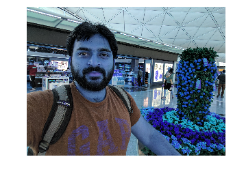
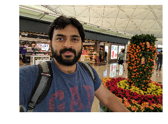

# Using OpenCV

<!-- TOC -->

- [Using OpenCV](#using-opencv)
    - [Goals](#goals)
    - [Starting opencv3 Docker to run the tutorials](#starting-opencv3-docker-to-run-the-tutorials)
    - [Read an image](#read-an-image)
        - [imread Usage](#imread-usage)
    - [Write an image](#write-an-image)
        - [imwrite Usage](#imwrite-usage)
    - [Showing image using matplotlib](#showing-image-using-matplotlib)
        - [plt.imshow Usage](#pltimshow-usage)
    - [Importing image_utils module](#importing-image_utils-module)
        - [Ipy.imshow Usage](#ipyimshow-usage)
        - [Ipy.imshow_large Usage](#ipyimshow_large-usage)
    - [References](#references)

<!-- /TOC -->

## Goals

- Starting opencv3 docker for this tutorial
- Learn how to read, save and show an image
- Learn how to use cv.imread, cv.imwrite
- Learn how to show figures in matplotlib in ipython notebook

## Starting opencv3 Docker to run the tutorials

- Install [docker](https://docs.docker.com/engine/getstarted/step_one/#step-1-get-docker) on your system
- Git clone the [opencv_tutorials](https://github.com/naren-m/opencv_tutorials)

```bash
mkdir opencv
cd opencv
git clone https://github.com/naren-m/opencv_tutorials.git
```

- Docker pull the narenm/opencv:py3 image

```bash
docker pull narenm/opencv:py3
```

- Start the docker image

```bash
docker run -it -v $PWD:/code -p 8888:8888 narenm/opencv:py3
```

In the docker prompt

- Start Jupyter in the docker and open the ipython notebook with token specified.

```bash
/run_jupyter.sh
```

## Read an image

Use function cv2.imread to read the image. Image should be in current working directory or should be given a full path.

Using the second argument(optional) for function, we can specify the following flags

- cv2.IMREAD_COLOR      : Default flag. Loads a color image
- cv2.IMREAD_GRAYSCALE  : Loads grayscale image
- cv2.IMREAD_UNCHANGED  : Loads image including alpha channel

> Note

> Instead of these three flags, you can simply pass integers 1, 0 or -1 respectively.

### imread Usage

```python
import cv2

# load the image and show some basic information on it
image = cv2.imread('hongkong_airport.jpg', cv2.IMREAD_UNCHANGED)

# Image Details
print("width: %d pixels" % (image.shape[1]))
print("height: %d pixels" % (image.shape[0]))
print("channels: %d" % (image.shape[2]))
```

Output:
    width: 3264 pixels
    height: 2448 pixels
    channels: 3


## Write an image

Use function cv2.imwrite to save the image.

First argument is file name and second is the image that we want to save

### imwrite Usage

```python
cv2.imwrite("newimage.png", image)
```


## Showing image using matplotlib

Using matplotlib.pyplot directly will give unexpected results as below.

Reason being
> OpenCV represents RGB images as multi-dimensional NumPy arrays… ___but in reverse order!___
> This means that images are actually represented in BGR order rather than RGB!

Fix for this

```python
plt.imshow(cv2.cvtColor(image, cv2.COLOR_BGR2RGB))
```

### plt.imshow Usage

```python
plt.axis("off")
%time plt.imshow(image)
```

Output:
    CPU times: user 230 ms, sys: 30 ms, total: 260 ms
    Wall time: 261 ms



So I had a small helper function in image_utils module.

## Importing image_utils module

```python
import sys

sys.path.append('/code/opencv_tutorials') # path to image_utils.py
from image_utils import Ipy
```

Ipy.imshow helper function looks as below

```python
@staticmethod
def imshow(input_image):
    """
    API to show mini image in ipython notebook, using matplotlib
    """
    import matplotlib.pyplot as plt

    cv_rgb = cv2.cvtColor(input_image, cv2.COLOR_BGR2RGB)
    plt.axis("off")
    plt.imshow(cv_rgb)
```

### Ipy.imshow Usage

```python
%time Ipy.imshow(image)
```

Output:
    CPU times: user 320 ms, sys: 10 ms, total: 330 ms
    Wall time: 328 ms




If we see the above image, it is small and not clear. So I had another helper function to show the bigger clear image.

Ipy.imshow_large helper function looks as below.

```python
@staticmethod
def imshow_large(input_image):
    """
    API is to show bigger images in ipython notebook. Uses PIL, IPython.display and BytesIO
    """
    from PIL import Image
    import IPython.display
    from io import BytesIO

    rgb_img = cv2.cvtColor(input_image, cv2.COLOR_BGR2RGB)
    img = Image.fromarray(rgb_img)

    b = BytesIO()
    img.save(b, format='png')

    IPython.display.display(IPython.display.Image(data=b.getvalue(), format='png', embed=True))
```

### Ipy.imshow_large Usage

```python
%time Ipy.imshow_large(image)
```

Output:

    CPU times: user 3.13 s, sys: 0 ns, total: 3.13 s
    Wall time: 3.13 s

___Caveat of using  'imshow\_large' is, it takes longer time to load and show the image___


## References

- [OpenCV tutorials source](https://github.com/naren-m/opencv_tutorials)
- [Instructions to start opencv docker](https://github.com/naren-m/opencv_tutorials/blob/master/README.md)
- [OpenCV-python tutorials](http://docs.opencv.org/3.2.0/dc/d2e/tutorial_py_image_display.html)
- [How to Display a Matplotlib RGB Image](http://www.pyimagesearch.com/2014/11/03/display-matplotlib-rgb-image/)
- [Using magics %time](https://ipython.org/ipython-doc/3/interactive/magics.html)
